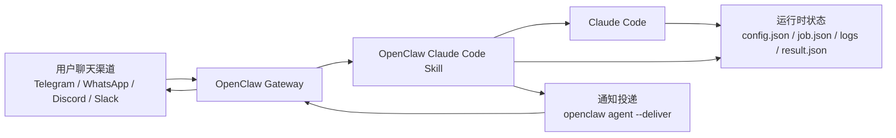
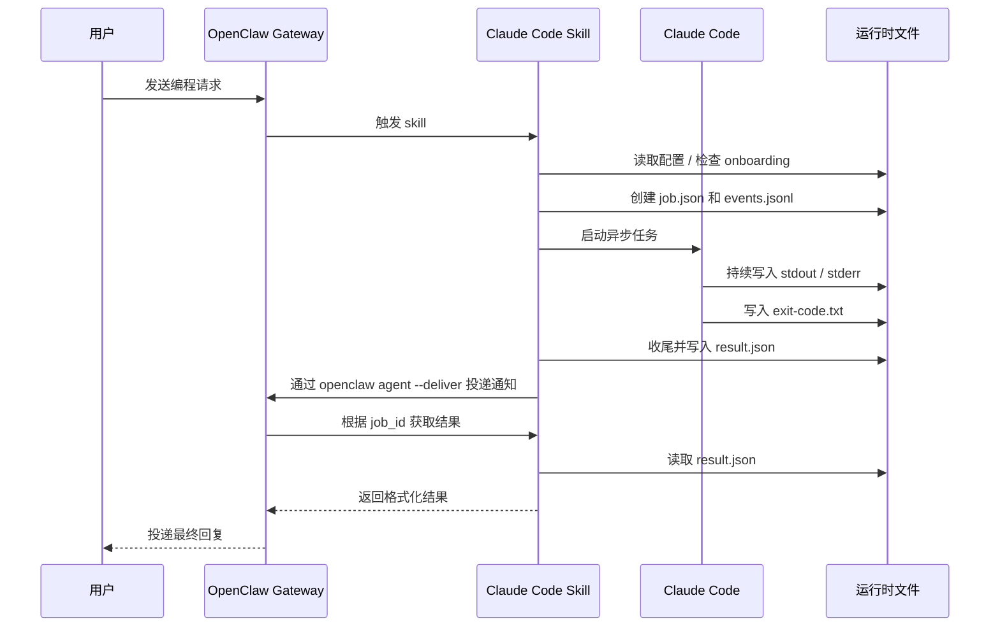

# OpenClaw Claude Code

[English](./README.md)

OpenClaw Claude Code 是一个 OpenClaw skill，用来把聊天中的编程任务异步派发给本地 Claude Code 执行。

它的目标不是在当前对话里长时间同步写代码，而是把任务提交为后台作业，持久化运行状态，并在任务完成后把完整结果再推回用户对话。

Claude Code 的执行发生在异步后台，不会阻塞当前与 agent 的会话，也不需要把整个长流程执行细节持续塞进当前对话里。主要的执行消耗发生在本地 Claude Code，而不是 OpenClaw 当前会话里，因此 OpenClaw 这边通常只承担任务派发和结果回传的少量 token，而不会因为完整编码流程带来巨量额外消耗。

## 能力概览

- 将聊天中的编程任务派发给本地 Claude Code
- 异步调度 Claude Code，不阻塞当前 OpenClaw agent 会话
- 支持 `headless` 和 `tmux` 两种运行模式
- 持久化 job 状态、日志、结果和交付物
- 支持取消任务、查看状态、查看日志、获取结果、acknowledge
- 使用 Claude `Stop` hook 作为异常收尾补偿
- 支持 onboarding 用户配置，包括时区
- 所有时间展示默认使用用户配置的时区
- 将重型编码循环放在本地 Claude Code 中执行，因此 OpenClaw 通常只承担任务派发和结果回传的少量 token

## 架构



核心流程：

1. 用户在聊天里描述编程任务。
2. OpenClaw 把任务提交给本 skill。
3. Skill 在后台启动 Claude Code。
4. 运行状态写入 OpenClaw 数据目录。
5. 任务完成后，OpenClaw 获取完整结果并投递格式化回复。

### 通信时序



## 依赖要求

- macOS 或 Linux
- Python 3.11+
- [uv](https://docs.astral.sh/uv/)
- 已安装并可执行的 [Claude Code](https://docs.anthropic.com/en/docs/claude-code) `claude`
- 已运行 Gateway 的 [OpenClaw](https://openclaw.ai)

## 安装

将仓库克隆到 OpenClaw 管理的 skills 目录：

```bash
git clone https://github.com/whoisjiahao/openclaw-claude-code.git ~/.openclaw/skills/openclaw-claude-code
cd ~/.openclaw/skills/openclaw-claude-code
uv sync
openclaw gateway restart
```

如果你的 OpenClaw 支持通过聊天安装 skill，可以直接发送这句话：

```text
安装这个 skill：`https://github.com/whoisjiahao/openclaw-claude-code`
```

## 首次使用与 Onboarding

首次激活时，skill 会收集以下偏好：

- 默认是否开启 Agent Teams
- 默认日志尾部行数
- 最大并发任务数
- 默认工作区根目录，用于项目发现
- 用户时区
- 默认通知渠道和目标

通知投递是 best-effort。若 `openclaw` CLI 不可用，或者没有配置通知目标，任务仍会正常完成，只是不会自动回传到聊天。

配置完成后你会看到：

```text
🎉 OpenClaw Claude Code 已完成初始化。

后续我可以把编程任务异步派发给 Claude Code 执行。任务完成后会自动通知你。

常用操作：
- 💬 直接告诉我编程任务，我会自动派发执行
- 📊 "任务进度怎样了" — 查看运行状态
- 📋 "看下日志" — 查看实时输出
- 📝 "结果呢" — 获取完成后的详细结果
- 🚫 "取消任务" — 停止正在运行的任务
- 📃 "有哪些任务" — 列出所有任务
```

## 示例

### 任务派发

```text
🚀 **任务已派发**

📋 任务：auth-refactor  
🔖 编号：`job_1774251330123_a1b2c3`  
📂 目录：`my-project/src`  
🎯 目标：重构认证中间件并补齐单元测试  
⏰ 开始时间：2026-03-27T18:15:30+08:00

任务在后台运行中，完成后会自动播报到当前对话。  
如需查看进度，随时告诉我。
```

### 开启 Agent Teams 和交付物时的任务派发

```text
🚀 **任务已派发**

📋 任务：generate-report
🔖 编号：`job_1774253000456_d4e5f6`
📂 目录：`analytics-service`
🎯 目标：生成本月用户增长分析报告
⏰ 开始时间：2026-03-27T22:30:00+08:00

🤝 Agent Teams：已开启
👥 协作模式：auto

📦 交付物：已要求，完成后会列出文件路径

任务在后台运行中，完成后会自动播报到当前对话。
如需查看进度，随时告诉我。
```

### 查看状态

```text
⚙️ 任务 `auth-refactor` 正在运行中。

已运行 3 分 42 秒，最近一次输出在 15 秒前。

需要我帮你看一下最新的日志吗？
```

### 查看日志

```text
🔄 任务仍在运行中，最近动态：

- 🔧 Read → src/service.py  
- 💬 正在分析服务层的依赖关系…  
- 🔧 Bash → pytest tests/ -v  
- 💬 测试全部通过，开始编写报告
```

### 任务完成

```text
✅ **任务完成**

📋 任务：auth-refactor
🔖 编号：`job_1774251330123_a1b2c3`

已完成认证中间件重构：将 `AuthMiddleware` 拆分为 `TokenValidator` 和 `SessionManager` 两个独立组件，新增 12 个单元测试，覆盖率从 43% 提升到 91%。

⏱ 耗时 2 分 34 秒 · 25 轮交互
💰 $1.39 · 177,138 tokens
```

### 带交付物的完成

```text
✅ **任务完成**

📋 任务：generate-report
🔖 编号：`job_1774253000456_d4e5f6`

已生成用户增长分析报告，包含注册趋势、留存率和渠道分布三个维度的数据。

📦 交付物：
- `analytics-service/output/growth-report.md`
- `analytics-service/output/charts.json`

⏱ 耗时 4 分 12 秒 · 38 轮交互
💰 $2.15 · 245,302 tokens
```

### 任务失败

```text
❌ **任务失败**

📋 任务：auth-refactor
🔖 编号：`job_1774251330123_a1b2c3`

重构过程中发现循环依赖无法自动解决：`AuthService` → `UserService` → `AuthService`。建议先手动解耦这两个模块的依赖关系。

⏱ 耗时 1 分 8 秒 · 12 轮交互
💰 $0.52 · 68,421 tokens
```

### 权限被拒绝

```text
⚠️ 执行过程中有 2 次权限被拒绝，可能影响任务完整性：
- 🔒 `Bash`: `rm -rf node_modules && npm install`
- 🔒 `Write`: `src/config/production.json`
```

### 任务取消

```text
🚫 **任务已取消**

📋 任务：auth-refactor
🔖 编号：`job_1774251330123_a1b2c3`

如果需要了解取消前的执行情况，我可以帮你查看日志。
```

### 并发上限

```text
⚠️ 当前正在运行的任务已达到上限（2 个），暂时无法接收新任务。

你可以等待当前任务完成，或取消某个任务后再提交。
```

## 运行时目录

默认情况下，运行数据会写到：

```text
$OPENCLAW_HOME/data/openclaw-claude-code
```

如果没有设置 `OPENCLAW_HOME`，则写到：

```text
~/.openclaw/data/openclaw-claude-code
```

每个 job 都有独立目录，包含：

- `job.json`
- `events.jsonl`
- `stdout.log`
- `stderr.log`
- `exit-code.txt`
- `result.json`
- 当要求交付物时创建 `artifacts/`

## Hook 配置

为了避免 runner 异常退出后任务无法正常收尾，需要配置 Claude Code 的 `Stop` hook：

```json
{
  "hooks": {
    "Stop": [
      {
        "matcher": "",
        "hooks": [
          {
            "type": "command",
            "command": "uv run --project /absolute/path/to/openclaw-claude-code python /absolute/path/to/scripts/bridge.py --runtime-root /abs/runtime hook finalize --stdin-json"
          }
        ]
      }
    ]
  }
}
```

请把项目路径和运行目录替换成你的真实安装路径。

## 仓库结构

```text
openclaw-claude-code/
├── README.md
├── README.zh-CN.md
├── SKILL.md
├── references/
│   ├── protocol.md
│   ├── ux-feedback.md
│   └── error-codes.md
├── scripts/
│   ├── bridge.py
│   └── debug_run.py
├── src/openclaw_claude_code/
│   ├── cli.py
│   ├── errors.py
│   ├── models.py
│   ├── runner.py
│   ├── runtime.py
│   ├── service.py
│   └── timeutils.py
└── tests/
    └── test_openclaw_claude_code.py
```

## 参考文档

- [SKILL.md](./SKILL.md)：OpenClaw skill 行为与操作规范
- [references/protocol.md](./references/protocol.md)：CLI 协议、schema、运行时布局
- [references/ux-feedback.md](./references/ux-feedback.md)：用户回复模板
- [references/error-codes.md](./references/error-codes.md)：错误码与恢复指引

## 开发

安装依赖并运行测试：

```bash
uv sync
.venv/bin/pytest -q
```

可选语法检查：

```bash
python -m compileall src tests
```
